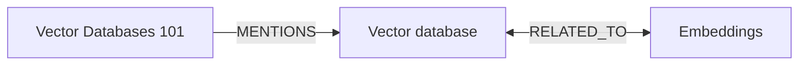

# GistGraph — AI Summaries & Reading Graph (Chrome Extension)

> **TL;DR**: GistGraph uses an LLM to summarize the page you’re on, extracts key topics/ideas, and saves them into a personal **knowledge graph** so you can see how your reading connects over time.


[](#)
[](#)
[](./LICENSE)

---

## Table of Contents
- [Features](#features)
- [Why a Graph?](#why-a-graph)
- [Screenshots](#screenshots)
- [How It Works](#how-it-works)
- [Architecture](#architecture)
- [Data Model](#data-model)
- [Privacy & Permissions](#privacy--permissions)
- [Install (User)](#install-user)
- [Build From Source (Dev)](#build-from-source-dev)
- [Configuration](#configuration)
- [Usage](#usage)
- [Export & Visualization](#export--visualization)
- [Testing](#testing)
- [Roadmap](#roadmap)
- [FAQ](#faq)
- [Contributing](#contributing)
- [License](#license)

---

## Features
- **One-click summaries** of any webpage (toolbar popup or context menu).
- **Topic & idea extraction** with optional entity linking and keyword clustering.
- **Personal reading graph** that shows how pages and ideas connect (nodes = pages/topics; edges = mentions/relatedness).
- **Local-first storage**: summaries, embeddings, and the graph live in your browser’s IndexedDB/`chrome.storage`.
- **Search & recall**: “What did I read about _X_ last week?” with date/topic filters.
- **Offline history enrichment**: revisit old tabs to generate summaries retroactively.
- **Privacy controls**: choose which sites to index; pause/resume capture; bulk delete.
- **Export**: JSON/GraphML/Mermaid for external visualization or analysis.

---

## Why a Graph?
Lists and bookmarks don’t capture relationships. A graph lets you:
- See **clusters** of related reading.
- Spot **bridges** (pages that connect disparate topics).
- Track **concept drift** (how your focus shifts over time).
- Answer **contextual queries** (e.g., all sources that shaped your understanding of “vector databases” in August).

---

## Screenshots
> Add real screenshots later—these paths are placeholders.

- Popup summary: `docs/screens/popup-summary.png`  
- Topic graph (mini): `docs/screens/graph-mini.png`  
- Full graph view: `docs/screens/graph-full.png`  
- Options page: `docs/screens/options.png`

---

## How It Works
1. **You click “Summarize”** (toolbar button or right-click).  
2. **Content script** collects page text (DOM extraction + readability pass + de-dupe).  
3. **Background service worker** sends text to the configured **LLM provider** to:
   - Produce a **structured summary** (TL;DR, bullet insights, citations by section).
   - Extract **topics/ideas** and **relations** (weights/confidence).
   - Optionally compute **embeddings** (for clustering / relatedness).
4. **Graph builder** inserts/updates nodes and edges in **IndexedDB** (with caching).  
5. **Popup & Graph views** render your updated knowledge graph and recent summaries.  

---

## Architecture
```
/src
  /background        # MV3 service worker: orchestration, LLM calls, graph updates
  /content           # DOM extraction, readability, messaging
  /popup             # UI: summarize, history, quick graph
  /options           # API keys, provider, thresholds, privacy, export
  /graph             # graph engine: schema, queries, layout helpers (D3/vis-network)
  /lib               # utils: chunking, rate-limit, storage, embeddings, prompts
  /types             # TypeScript shared types
public/manifest.json # Manifest V3
```

**Key Technologies**
- **Manifest V3** (service worker background)
- **TypeScript + Vite** bundling
- **IndexedDB** (via Dexie) + `chrome.storage.sync` for lightweight settings sync
- **LLM providers** via pluggable adapters (OpenAI/Anthropic/local server)
- **Embeddings** (optional) for topic similarity & clustering
- **D3 / vis-network** for graph visualization

---

## Data Model

### Node Types
- **Page**: `{ id, url, title, summary, createdAt, tags[], embedding? }`
- **Topic**: `{ id, name, kind: 'entity'|'concept'|'keyword', aliases[], embedding? }`

### Edge Types
- **MENTIONS**: `Page -> Topic` (weight = mention frequency/relevance)
- **RELATED_TO**: `Topic <-> Topic` (weight = cosine similarity / co-occurrence)
- **CITES** (optional): `Page -> Page` (inferred from outbound links)

### Example Stored Record
```json
{
  "page": {
    "id": "page_b3d1...",
    "url": "https://example.com/vector-databases",
    "title": "Vector Databases 101",
    "summary": {
      "tldr": "Vector DBs store embeddings to enable semantic search.",
      "bullets": [
        "Core ops: insert, search, update, delete",
        "Index types: HNSW, IVF, PQ"
      ],
      "sources": [{"selector":"article h2:nth(3)","quote":"..."}]
    },
    "createdAt": "2025-09-05T17:28:00Z",
    "embedding": [/* optional float array */]
  },
  "topics": [
    {"id":"topic_31c...","name":"Vector database","kind":"concept"},
    {"id":"topic_52a...","name":"Embeddings","kind":"concept"}
  ],
  "edges": [
    {"type":"MENTIONS","from":"page_b3d...","to":"topic_31c...","weight":0.92},
    {"type":"RELATED_TO","from":"topic_31c...","to":"topic_52a...","weight":0.71}
  ]
}
```

---

## Privacy & Permissions

**Requested Chrome permissions**
- `activeTab`: run on the current page when you click.
- `scripting`: inject content script on demand.
- `storage`: save settings and graph locally.
- `contextMenus` (optional): “Summarize this page” right-click.
- `tabs` (optional): title/URL for currently active tab.

**Privacy Principles**
- No data leaves your browser **unless** you enable a cloud LLM provider.
- API keys are stored locally (`chrome.storage.local`) and never uploaded.
- You can exclude sites, pause capture, and bulk delete your data anytime.

---

## Install (User)

1. Download a release from **Releases** and unzip.  
2. Open **chrome://extensions** → toggle **Developer mode** → **Load unpacked** → select the unzipped `dist/` folder.  
3. Click the GistGraph icon → open **Options** → configure your LLM provider and thresholds.  

> Note: If using a cloud LLM, you’ll need an API key (see [Configuration](#configuration)).

---

## Build From Source (Dev)

```bash
# 1) Clone
git clone https://github.com/<you>/gistgraph.git
cd gistgraph

# 2) Install deps
pnpm i      # or npm i / yarn

# 3) Dev build (watches + rebuilds)
pnpm dev

# 4) Production build
pnpm build

# 5) Load dist/ as unpacked extension in chrome://extensions
```

**Scripts**
- `dev`: Vite watch + copy manifest/assets to `dist/`
- `build`: production build
- `lint`, `typecheck`, `test`: quality & tests

---

## Configuration

Create `.env` (not checked in):

```dotenv
# Choose one or more; only what you enable will be used
OPENAI_API_KEY=sk-...
OPENAI_MODEL=gpt-4o-mini

ANTHROPIC_API_KEY=...
ANTHROPIC_MODEL=claude-3-haiku

# Optional local LLM relay (self-hosted):
LLM_BASE_URL=http://localhost:11434/v1
LLM_MODEL=llama3.1

# Embeddings (optional; comment out to disable embedding features)
EMBEDDINGS_PROVIDER=openai
EMBEDDINGS_MODEL=text-embedding-3-small

# Summarization chunking
CHUNK_SIZE=8000
CHUNK_OVERLAP=400
```

Set providers & thresholds in the **Options** page:
- Max tokens / temperature
- Topic confidence threshold
- Similarity threshold for `RELATED_TO` edges
- Site allow/deny list

---

## Usage

**Summarize a page**
- Click the extension icon → **Summarize**.
- Or right-click → **GistGraph → Summarize this page**.

**View the graph**
- Popup → **Open Graph** (mini)  
- Options → **Full Graph** (separate tab) with filters (date, domain, topic)

**Search**
- Popup search bar: type a topic name to jump to that node.
- “Recall” queries: filter by date range and domain.

**Keyboard shortcuts (customizable)**
- `Alt+G`: Summarize current tab
- `Alt+Shift+G`: Open graph

---

## Export & Visualization

**Exports**
- **JSON**: raw nodes/edges (`/export/graph.json`)
- **GraphML**: for Gephi/Cytoscape
- **Mermaid**: quick diagrams for docs



**Viewers**
- Built-in mini graph (D3/vis-network)
- `docs/graph-viewer.html` (drop your JSON to explore)

---

## Under the Hood (Key Implementation Notes)

### Summarization & Extraction
- **Readability pipeline**: removes nav/ads, keeps main content; dedupes repeated text.
- **Chunking**: large pages get split into chunks; LLM returns partial summaries; we compose a final summary.
- **Structured prompts**: model returns JSON for `summary`, `topics[]`, `relations[]` with confidence scores.
- **Dedup/Aliasing**: topic names normalized; simple aliasing with lowercase + punctuation strip; optional embedding-based merge.

### Graph Construction
- **Node upsert** by natural keys (Page.url, Topic.name).
- **Edge weights**:
  - `MENTIONS`: frequency * confidence (bounded 0–1).
  - `RELATED_TO`: cosine(topicA, topicB) or Jaccard on co-occurrence windows.
- **Smoothing**: decay old weights; strengthen edges as you read more.

### Storage
- **IndexedDB (Dexie)** tables: `pages`, `topics`, `edges`, `config`, `embeddings`.
- **Sync**: only config (provider, thresholds) via `chrome.storage.sync`.

### Performance & Limits
- **Rate limiting** outbound LLM calls; caching summaries by URL+hash.
- **Retry with backoff** on network errors; partial results are stored and reconciled later.

---

## Minimal Manifest & Scripts (Snippets)

**`public/manifest.json`**
```json
{
  "manifest_version": 3,
  "name": "GistGraph",
  "version": "0.1.0",
  "action": { "default_title": "GistGraph", "default_popup": "popup.html" },
  "permissions": ["activeTab", "scripting", "storage", "contextMenus"],
  "background": { "service_worker": "background.js", "type":"module" },
  "icons": { "16":"icons/16.png","48":"icons/48.png","128":"icons/128.png" }
}
```

**Summarize (pseudo-TypeScript)**
```ts
// src/background/summarize.ts
export async function summarizePage(payload: { url: string, text: string }) {
  const summary = await llm.summarize(payload.text);
  const topics = await llm.extractTopics(payload.text);
  const relations = relateTopics(topics);           // embeddings / co-occurrence
  await graph.upsertPage(payload.url, summary, topics, relations);
  return { summary, topics, relations };
}
```

---

## Testing
- **Unit**: graph utils, prompt parsers, store (Vitest/Jest).
- **E2E**: Puppeteer extension runner for common flows (summarize → graph).
- **Mock LLM**: deterministic fixtures to avoid API costs in CI.

Run:
```bash
pnpm test
pnpm test:e2e
```

---

## Roadmap
- Browser-agnostic build (Firefox MV3).
- Time-series graph playback (“how my understanding evolved”).
- Topic aliasing via community knowledge bases (e.g., Wikidata linking).
- Inline on-page highlights tied to summary bullets.
- Multi-provider routing (cheap fast model → refine with better model).
- Local embedding inference (WebGPU) where feasible.

---

## FAQ

**Does it summarize paywalled content?**  
Only if the content is accessible to your browser. Respect site terms.

**Will my data be uploaded?**  
Not unless you enable a cloud LLM. Otherwise, everything stays local.

**Can I import old bookmarks/history?**  
Import is planned; you can currently summarize any open page on demand.

**What if the model hallucinates?**  
Summaries are assistive. We include citations/quotes and show confidence scores.

---

## Contributing
This is a personal project, but PRs are welcome:
1. Fork → branch → PR with a clear description.
2. Please add tests for new logic.
3. For new providers, implement the `LLMAdapter` interface.

---

## License
MIT © You. See [LICENSE](./LICENSE).

---

### Appendix: Prompts (Optional)

**Summarize Prompt (schema-first)**
```text
You are a precise research assistant. Return strict JSON:
{
  "tldr": "...",
  "bullets": ["...", "..."],
  "sources": [{"selector": "...", "quote": "..."}],
  "topics": [{"name":"...", "kind":"concept|entity|keyword", "confidence":0.0}]
}
```

**Topic Relations Prompt**
```text
Given topics with brief definitions, return pairs with a relatedness score (0–1) and rationale.
```

---

> Rename “GistGraph” to your preferred project name, update icons/screenshots, and ship!
